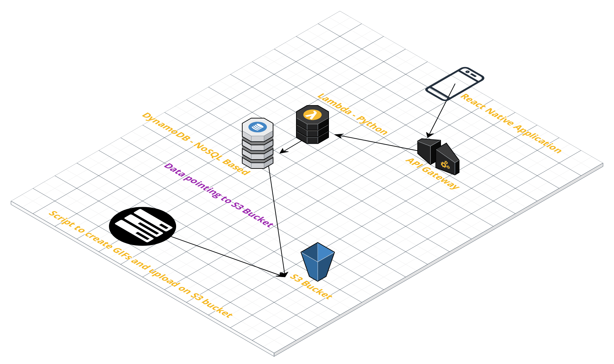
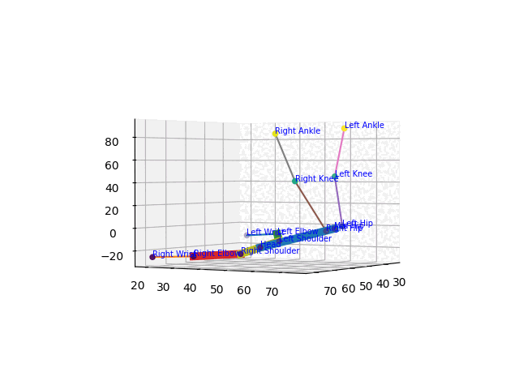
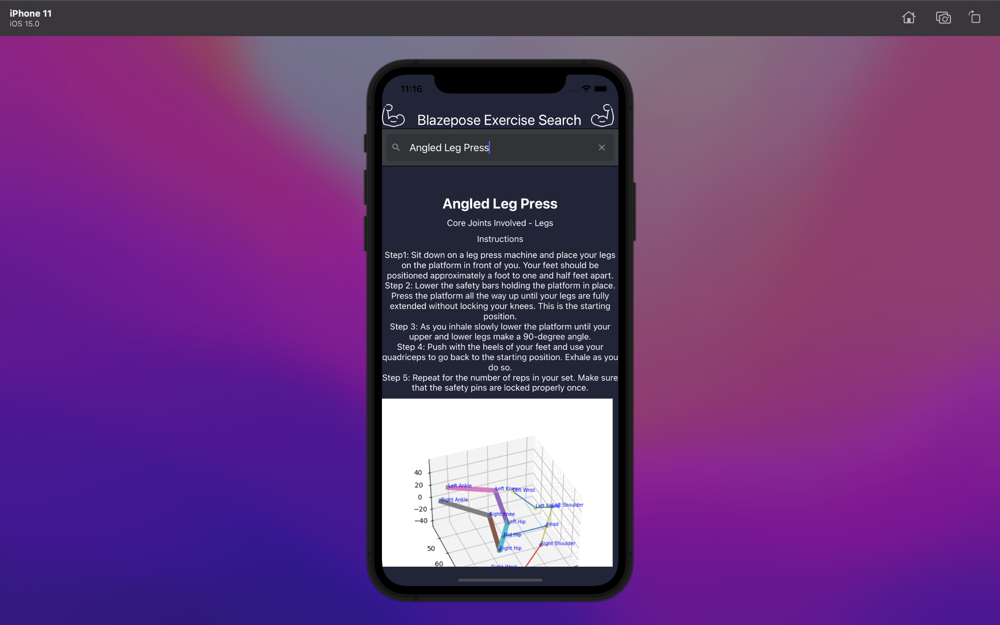

# Blazepose Excercise Search

This project is intended to create an application to help people visualize joint movements during various muscle training excercises.

## Architecture

## Dataset

Please email me on achints0810@gmail.com for dataset with the purpose.

## Tech stack:

1. S3 bucket
2. NoSQL based AWS DynamoDB
3. Python
4. Lambda
5. API gateway
6. Matplotlib
7. Pandas
8. React Native
9. Netlify
10. Expo
11. Javascript

## GOALS

1. Preprocess data to help further in identifying category of excercises.
2. Create Animations of all kinds of excercises.
3. Create a backend service to fetch animations through API calls
4. Create a database service to store the data
5. Create API to get excercises data to the client end
6. Create a native application to help people search the excercise and display the Blazepose.

## Features

1. Preprocessed and cleaned excercise name so that more information like excercise category and instructions can be extracted.
2. Using category, identified main important joint areas.
3. Created GIFs with thickened bones for areas where main joint movements are involved. This would help users focus on main important movements.
4. Added 360° Visualization to understand joint movement from every angle.
5. Added Labels for node points in the GIFs.
6. Added spine and hips intersection to help understand the movement of spine and hips movements during excercises.
7. Animations being fetched form S3 bucket reducing size of client-side application and all animations fetching on demand.
8. Created database on Nosql based dynamodb to store data.
9. Created get API to fetch excercise data.
10. Created a native application using React native, to create applications for all interfaces like Android, iOS and web
11. Created client side search engine to search for excercise by users.
12. Added meta info like instructions and category to help users better understand about the excercises.
13. Automated deployment and CI/CD using netlify and expo.

## Code Structure

1. Scripts - Contains script to preprocess and create GIFs/animations from raw data.
2. Backend - Code for database,buckets, APIs to get the data.
3. Frontend - React native application for Blazepose Visualization application.
4. Screenshots - All the relevant screenshots

# Screenshots

## Example GIFs created -

## Screenshots from iOS application -

## Thank You! :)
